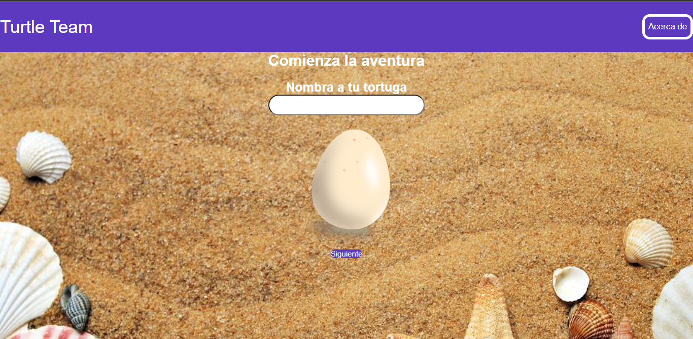
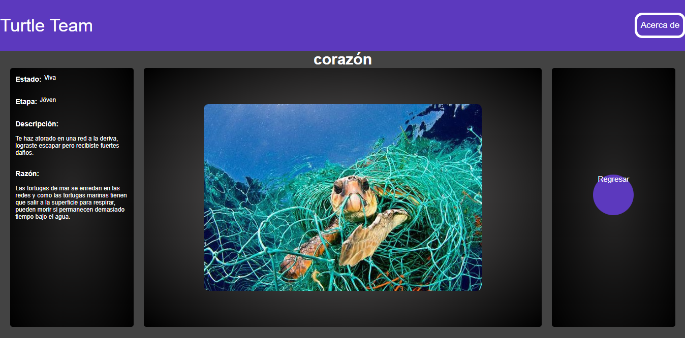

# footprints

## capturas de proyecto

### Captura de página inicial.


### Captura de página que exhibe la problemática.


## Project setup
```
npm install
```

### Compiles and hot-reloads for development
```
npm run serve
```

### Compiles and minifies for production
```
npm run build
```

### Customize configuration
See [Configuration Reference](https://cli.vuejs.org/config/).
